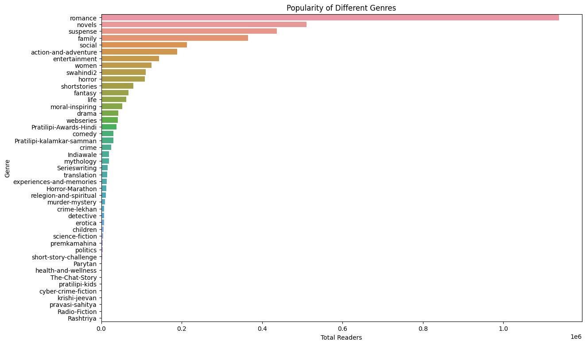

# Story Recommendation System

## Overview

This project develops a predictive model to recommend at least five Pratilipi stories to each user based on their reading history. The system leverages user-item interactions to generate personalized suggestions.

## Table of Contents

1. [Key Features](https://chatgpt.com/c/67b707f3-ddcc-800c-98f0-cadf987991ac#key-features)
2. [Data Processing Steps](https://chatgpt.com/c/67b707f3-ddcc-800c-98f0-cadf987991ac#data-processing-steps)
3. [Experimental Setup](https://chatgpt.com/c/67b707f3-ddcc-800c-98f0-cadf987991ac#experimental-setup)
4. [Results](https://chatgpt.com/c/67b707f3-ddcc-800c-98f0-cadf987991ac#results)
5. [Repository Structure](https://chatgpt.com/c/67b707f3-ddcc-800c-98f0-cadf987991ac#repository-structure)
6. [Dataset Preview](https://chatgpt.com/c/67b707f3-ddcc-800c-98f0-cadf987991ac#dataset-preview)
7. [Plots](https://chatgpt.com/c/67b707f3-ddcc-800c-98f0-cadf987991ac#plots)
8. [Model Architecture](https://chatgpt.com/c/67b707f3-ddcc-800c-98f0-cadf987991ac#model-architecture)
9. [Evaluation Metrics](https://chatgpt.com/c/67b707f3-ddcc-800c-98f0-cadf987991ac#evaluation-metrics)
10. [License](https://chatgpt.com/c/67b707f3-ddcc-800c-98f0-cadf987991ac#license)

## Key Features

* **Embedding Dimension** : Utilizes 50 factors for both user and item embeddings.
* **Network Architecture** :
* Input Layer: 100 neurons (concatenated 50-dimensional user and item embeddings).
* Hidden Layers: 128 → 64 → 32 neurons.
* Output Layer: 1 neuron with sigmoid activation.
* **Regularization** : Incorporates dropout layers with a rate of 0.2 to prevent overfitting.

## Data Processing Steps

1. **Timestamp Conversion** :

* Converted 'updated_at' and 'published_at' fields to datetime format.
* Sorted interactions chronologically.

1. **Data Organization** :

* Created user and item mappings for model input.
* Normalized reading percentages.
* Addressed missing values appropriately.

1. **Data Preparation** :

* Split data into training and testing sets.
* Constructed user-item interaction matrices.
* Generated negative samples for training.

## Experimental Setup

* **Model Configuration** :
* Embedding Size: 50
* Learning Rate: Determined through experimentation.
* Batch Size: Optimized for efficient training.
* Dropout Rate: 0.2 for regularization.
* **Training Process** :
* Employed binary cross-entropy loss.
* Implemented mini-batch training.
* Monitored training and validation metrics.
* Saved the best-performing model based on validation performance.
* **Evaluation Metrics** :
* Top-K recommendation accuracy.
* Hit rate.
* Model convergence monitoring.

## Results

* Successfully generated personalized top-5 recommendations for users.
* The model demonstrated good convergence during training.
* Effectively handled sparse user-item interactions.
* Provided a scalable solution suitable for large user bases.

## Repository Structure

* `main.py`: Main script to run the recommendation system.
* `model.py`: Contains the neural network model definition.
* `recommendation_experiment.ipynb`: Jupyter notebook detailing the experimentation process.
* `requirements.txt`: Lists the dependencies required to run the project.
* `best_model.pt`: Saved state of the best-performing model.
* `user_mapping.pt` & `item_mapping.pt`: Serialized user and item mappings.
* `content/`: Directory containing data files.

## Dataset Preview

## Plots

## Model Architecture

The recommendation system is built using a neural network with embedding layers for users and items. The architecture is designed to capture latent features and predict user-item interactions effectively.

### **Embedding Layer**

* **User Embedding** : 50-dimensional vector representing each user.
* **Item Embedding** : 50-dimensional vector representing each item.
* **Concatenation** : The user and item embeddings are concatenated, forming a 100-dimensional input vector.

### **Network Architecture**

* **Input Layer**
  * Accepts a 100-dimensional vector (concatenated user and item embeddings).
* **Fully Connected Hidden Layers**
  * **First Hidden Layer** :
  * 128 neurons
  * Activation: ReLU
  * Dropout: 0.2
  * **Second Hidden Layer** :
  * 64 neurons
  * Activation: ReLU
  * Dropout: 0.2
  * **Third Hidden Layer** :
  * 32 neurons
  * Activation: ReLU
* **Output Layer**
  * 1 neuron
  * Activation Function: Sigmoid (predicts a probability score between 0 and 1)

### **Regularization Techniques**

* **Dropout Layers** : Applied with a rate of **0.2** after the first and second hidden layers to prevent overfitting.
* **L2 Regularization** : Applied on embedding layers to improve generalization.

## Evaluation Metrics

### 1. Mean Squared Error (MSE)

MSE measures the average squared difference between predicted and actual ratings. Lower MSE values indicate better model accuracy.

* **Computed Value:** `0.0465`

### 2. Root Mean Squared Error (RMSE)

RMSE is the square root of MSE, making it more interpretable as it retains the unit of the original values. It penalizes larger errors more than smaller ones.

* **Computed Value:** `0.2156`

### 3. Mean Absolute Error (MAE)

MAE measures the average absolute difference between predicted and actual ratings. It provides a more direct interpretation of prediction errors.

* **Computed Value:** `0.1136`

## Demonstration

Deployed the model locally in a streamlit web application.

